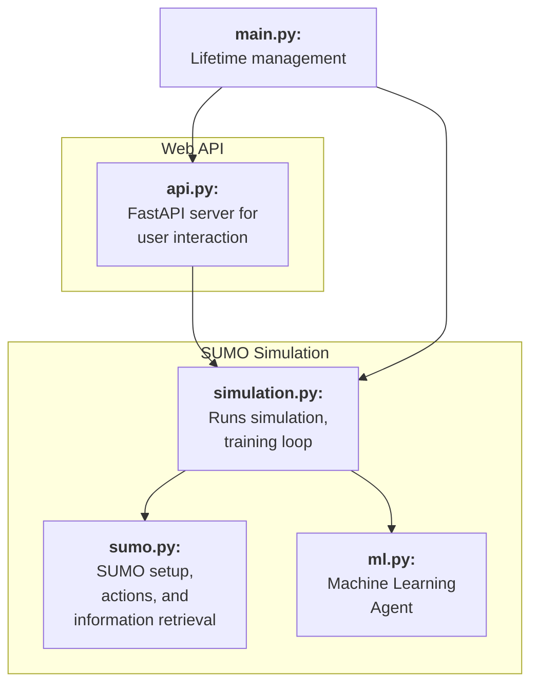

```mermaid
graph TD
    subgraph "SUMO Simulation"
        A["`**simulation.py:**
        Runs simulation,
        training loop`"] --> B["`**sumo.py:**
        SUMO setup,
        actions, and
        information retrieval`"]
        A --> C["`**ml.py:**
        Machine Learning
        Agent`"]
    end
    subgraph "Web API"
        D["`**api.py:**
        FastAPI server for
        user interaction`"] --> A
    end
    E["`**main.py:**
    Lifetime management`"] --> A
    E --> D
```
